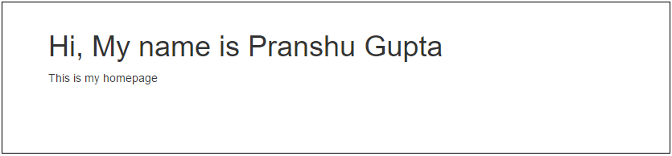
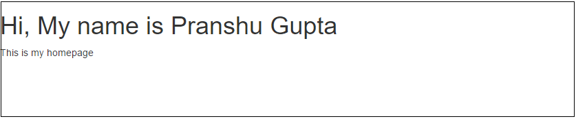

[Previous: GitHub Pages](GitHub_Pages.md)

# More on Twitter Bootstrap
Pranshu Gupta

To include Bootstrap in your page, insert the follwing lines in the head element of your HTML page. Because Bootstrap's Javascript requires jQuery, we need to include that before bootstrap.js.

    <link href="path to bootstrap.css file" rel="stylesheet">
    
    

To download jQuery, visit the page: https://code.jquery.com/jquery-3.2.1.min.js

To download Bootstrap, visit: https://github.com/twbs/bootstrap/releases/download/v3.3.7/bootstrap-3.3.7-dist.zip

Bootstrap will be downloaded as .zip file extract it and put it in the same folder where you have your HTML file.

Your HTML will look something like this:

    <!DOCTYPE html>
        <head>
            <title> My Home Page </title>
            <link href="bootstrap/css/bootstrap.css" rel="stylesheet">
            
            
        </head>
        <body>
            <h1>Hi, My name is Pranshu Gupta</h1>
            
This is my homepage

        </body>
    </html>

## Container
The bootstrap container class is a container for the rows in grid layout in the same way the row class is the container for columns. The following code will properly align the heading and the paragraph with suitable padding and margin.

        <body>
            

                

                    <h1>Hi, My name is Pranshu Gupta</h1>
                    
This is my homepage

                

            

        </body>

If we had not used the container, we would get something like this:

## Navigation Bar
We can put the important links on our page at the top for easier navigation in form of a navbar. 

Use the following code to add a navbar:

    <nav class="navbar navbar-default">
        

            

                <a class="navbar-brand" href="#">BRAND</a>
            

            <ul class="nav navbar-nav navbar-right">
                <li><a href="#">Link 1</a></li>
                <li><a href="#">Link 2</a></li>
                <li><a href="#">Link 3</a></li>
            </ul>
        

    </nav>

This will add a navbar with default bootstrap styling. We have addded three links in the navbar to the extreme right. To keep the links in the left remove the class `navbar-right` from the unordered list of the link.

    <ul class="nav navbar-nav">

Bootstrap also provides another styling in the class `navbar-inverse`. If we use `navbar-inverse` instead of `navbar-default` we get the following look:

To make the navbar responsive, we add a button to the navbar-header which will appear when the screen size is small. We add classes to the list of the links in navbar so that they collapse when there is not enough space and are visible only when the user clicks on the menu button.

    

        <button type="button" class="navbar-toggle collapsed" data-toggle="collapse" data-target="#mynavlinks" aria-expanded="false">
            Toggle navigation
            Menu
        </button>
        <a class="navbar-brand" href="#">Pranshu</a>
    

We need to put the unordered list of links of the navabr in a div element and add the classes `navbar-collapse` and `collapse` to that div. The code should look like this:

    

        <ul class="nav navbar-nav navbar-right">
            <li><a href="#">Link 1</a></li>
            <li><a href="#">Link 2</a></li>
            <li><a href="#">Link 3</a></li>
        </ul>
    

So, the complete code for the navbar will be:

    <nav class="navbar navbar-default">
        

            

                <button type="button" class="navbar-toggle collapsed" data-toggle="collapse" data-target="#mynavlinks" aria-expanded="false">
                    Toggle navigation
                    Menu
                </button>
                <a class="navbar-brand" href="#">Pranshu</a>
            

            

                <ul class="nav navbar-nav navbar-right">
                    <li><a href="#">Link 1</a></li>
                    <li><a href="#">Link 2</a></li>
                    <li><a href="#">Link 3</a></li>
                </ul>
            

        

    </nav>

## Carousel
A Carousel is a slideshow of images. To create a carousel using Bootstrap, we create a div with carousel class. We add another class 'slide' to this div. Bootstrap defines the sliding animation in this class. The carousel has three componenets - the indicators, the images and the left-right controls. The indicators are ordered list of elements that point to one of the images in the carousel. This is done by the 'data-slide-to' attribute. The data-target attribute of the indicators points to the id of the carousel's outermost div, this tells the indicators which carousel to operate on (suppose we had two carousels on the same page).

The content of the carousel are enclosed in a div with class 'carousel-inner'. In this div, for each slide we have a div with class 'item' which contains the HTML for the image and other content like captions etc. 

    

        <ol class="carousel-indicators">
            <li data-target="#myCarousel" data-slide-to="0" class="active"></li>
            <li data-target="#myCarousel" data-slide-to="1"></li>
            <li data-target="#myCarousel" data-slide-to="2"></li>
        </ol>
        

            

                
                <!-- You can add more content here (captions etc), to do so, create a div here and add the class 'carousel-caption' to it -->
            

            

                
                <!-- You can add more content here (captions etc), to do so, create a div here and add the class 'carousel-caption' to it -->
            

            

                
                <!-- You can add more content here (captions etc), to do so, create a div here and add the class 'carousel-caption' to it -->
            

        

        <a class="left carousel-control" href="#myCarousel" data-slide="prev">
            
        </a>
        <a class="right carousel-control" href="#myCarousel" data-slide="next">
            
        </a>
    

An example for a carousel item with caption will be:

    

        
        

            <h3>Chicago</h3>
            
Thank you, Chicago!

        

    

The left right controls are hyperlinks with class 'carousel-control' and refer to the id of the carousel's outermost div. The 'data-slide' attribute tells which item will the carousel slide to when the user clicks the control.

Here is the example page we discussed in class: [Page with Carousel](https://pranshu258.github.io/WebDev/page/index.html)

## Writing your own CSS

One important thing that I want to clarify is that anything we do with Bootstrap can be done without using Bootstrap by writing our own CSS (and JS). For example, the navbar we created is a div with some padding (say 2%) and background-color: gray, with an unordered list of links position on the right, styled such that we see the list items in the same line with no bullets. You can see the bootstrap.css file that we included in our page to see the exact CSS that is defined. For example, the CSS for 'container' class is at line 1584 in 'bootstrap.css' file, it says the following:

    .container {
        padding-right: 15px;
        padding-left: 15px;
        margin-right: auto;
        margin-left: auto;
    }

We have already discussed what padding means (empty space around an element). In the same way, we can understand padding-right and padding-left etc. Similarly for margin, auto means the browser may automatically decide the best margin value for the element.

Immediately after this, we have the following lines:
 
    @media (min-width: 768px) {
        .container {
            width: 750px;
        }
    }
    @media (min-width: 992px) {
        .container {
            width: 970px;
        }
    }
    @media (min-width: 1200px) {
        .container {
            width: 1170px;
        }
    }
    
These are called media queries, they are used when we want to style an element differently for different screen sizes. For example, in the above code, the width of a div with container class will be 750 pixels in all devices which have at least 768 pixels wide screen. Similarly, you can understand the next three media queries. If you add other CSS properties like color, border, background-color etc inside the media queries, you can see that those properties will reflect the styling as per the screen size. You can also add styling for multiple classes in the same media query as well. For example, at line 4194 in bootstrap.css you can see:

    @media (min-width: 768px) {
        .navbar-collapse {
            width: auto;
            border-top: 0;
            -webkit-box-shadow: none;
            box-shadow: none;
        }
        .navbar-collapse.collapse {
            display: block !important;
            height: auto !important;
            padding-bottom: 0;
            overflow: visible !important;
        }
    }

In this code, we can see the '!important' flags, this flag is used when we want to override all other CSS on the same element. However, we should not use it unless it is absolutely necessary. 
The display property has many possible values like 'block', 'inline', 'none' etc. Block is usually the default behavior when things are shown like normal text. Inline is used to show the text inside the element in a single line, for example, if we set the value of CSS display property to inline for a list, the items in the list will appear in the same line (remember the list in navbar). Also, in the navbar, we did not have the bullet points that come with an unordered list, for that we have to CSS property 'list-style' to 'none'.

We discussed that to style an HTML element with id "myID" we will refer to it as "#myID" in CSS. We can also define styles hierarchically, for example, if we want to say that all the paragraphs (recall the 
 tag) that are inside the div with id "myID" in our page should have a padding of 10px, we use the following CSS. Note that this does not affect the 
 items that are outside the div with id "myID". Similarly, this concept can be extended to hierarchical styling with classes (recall that to refer to classes we use '.' in CSS before the class name). 

    #myID p {
        padding: 10px;
    }

Now if we do the following, the style will apply only to those paragraphs which are directly inside the div with id "myID". If a paragraph is inside a div which in turn is inside the div with id "myID", then this styling won't apply to that paragraph.

    #myID > p {
        padding: 10px;
    }

Bootstrap is just a 7000 lines long CSS file with 2000 lines long JavaScript file to support the CSS for animations etc. You don't need to read the entire file. You can just search for the bootstrap classes you already know and observe how the CSS corresponding to that class is defined. 
Don't edit the Bootstrap file, if you want to override the style given by bootstrap, create your own CSS file with the style you want and include it in your HTML after the bootstrap CSS. Including your CSS after bootstrap CSS is important otherwise bootstrap will override your CSS, don't use the !important flag, it is not recommended. 

[Next: JavaScript Basics](JavaScript.md)