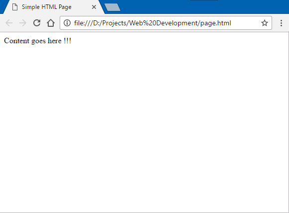

[Previous: Introduction](Introduction.md)

# Hyper Text Markup Language
Pranshu Gupta

HTML is the standard language used to write web pages, it describes the structure and content of the page using markup. There are different elements in HTML to create represent different components of the page. These elements are represented by HTML Tags. These tags may have attributes that specify additional properties of the component. 

The general outline of any HTML page is as follows:

    <!DOCTYPE html>
    <html>
        <head>
            <title>Simple HTML Page</title>
            <!-- Other meta information, scripts and stylesheets -->
            <!-- This is a comment -->
        </head>
        <body>
            Content goes here !!!
        </body>
    </html>

## HTML Tags

[Next: Github Pages](GitHub_Pages.md)
