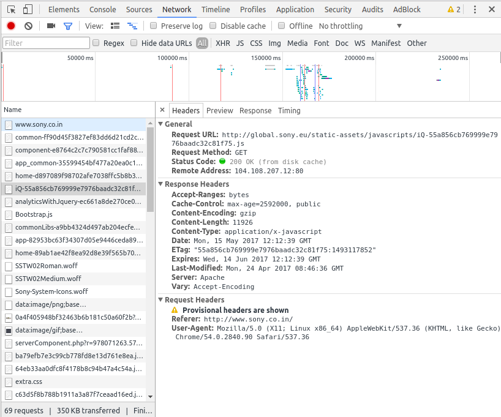

[Previous: Contents](README.md)

# Introduction to Web Development
Pranshu Gupta

## The Internet
The Internet is a network of networks of computers all over the world. It is an infrastructure that allows any two computers connected to the internet to communicate and share information with each other under some set of rules or protocols. HTTP, FTP, SMTP, IMAP etc are some of the protocols used on the internet.

[Wikipedia Article: Internet](https://en.wikipedia.org/wiki/Internet)

## The World Wide Web
The World Wide Web is an information sharing model built on top of the internet. It is an information space which houses a huge collection of interlinked documents that can be accessed via the internet under HTTP.
Each document on the internet has an address which is required to locate it on the network, this address is called URL (Uniform Resource Locator).
These documents can also have other associated resources such as videos, images etc. The language used to create these documents is called HTML.

The World Wide Web is not synonymous to the internet, it is a part of the internet - a big part. Internet also contains other things like Email, FTP (File Transfer Protocol), DNS (Domain Name Service), TLS (Transport Layer Security) and other services,

[Wikipedia Article: WWW](https://en.wikipedia.org/wiki/World_Wide_Web)

## Hyper Text Transfer Protocol
HTTP is a protocol which allows the fetching of resources such as HTML documents over the internet. In a typical scenario, the web browser acts as the user-agent and sends requests for a HTML document hosted by some server. The server is a computer connected to the internet which handles the request and sends a response to the user-agent. The browser then parses this response and generates the view for the user. This may involve further requests to fetch images and other multimedia files embedded in the document.

We can use the Developer Tools provided in browsers to see all the HTTP requests that were made by the browser when we visit some website. To open developer tools in Google Chrome press Ctrl+Shift+J. The requests are shown in the network tab of the developer tools. Click on one the requests to see more details like headers etc. 

The following image shows the requests made when fetching the page at https://developer.mozilla.org/en-US/docs/Web/HTTP/Overview.

This image shows the request and response headers when fetching a script for http://www.sony.co.in/

HTTP is simple, HTTP messages can be read and understood by humans. This allows easier testing and development. We can use http-console package in node to run simple HTTP requests. Another tool to test http requests is Postman. [Postman](https://chrome.google.com/webstore/detail/postman/fhbjgbiflinjbdggehcddcbncdddomop) is available as a Chrome Desktop App in Chrome Web Store.

[Install NodeJS](https://nodejs.org/en/download/). For Ubuntu following commands will work:

    $ sudo apt install nodejs
    $ sudo apt install npm
    $ sudo ln -s /usr/bin/nodejs /usr/bin/node

Now that we have installed NodeJS, we will go ahead and install the HTTP console package for node

    $ sudo npm install http-console2 -g

Let's connect to a HTTP website and make a HTTP GET request:

    $ http-console http://getbootstrap.com
    > http-console 0.7.0                                                                                                > Welcome, enter .help if you're lost.                                                                              > Connecting to getbootstrap.com on port 80.                                                                        http://getbootstrap.com:80/> GET /

Here we have made a HTTP GET request for a webpage located at getbootstrap.com, the response that we get from the server is as follows:

    HTTP/1.1 200 OK
    Set-Cookie: __cfduid=d68b830a749f31db8f5e92d79810fc6331494847411; expires=Tue, 15-May-18 11:23:31 GMT; path=/; domain=.getbootstrap.com; HttpOnly
    Access-Control-Allow-Origin: *
    Expires: Mon, 15 May 2017 11:33:32 GMT
    Cache-Control: max-age=600
    Content-Encoding: gzip
    X-Github-Request-Id: 59E5:7AF6:8E9940:B30D9E:5914630D
    Server: cloudflare-nginx
    Cf-Ray: 35d562b0e0a3704a-SIN
    Content-Length: 3156
    Content-Type: text/html; charset=utf-8
    Last-Modified: Wed, 19 Oct 2016 15:43:42 GMT
    Connection: close

    HTML Content Here....

We can also send headers in HTTP requests, for example the If-Match header. This header is used for cache validation with the help of ETag (Entity Tag). 

    If-Match: "bfc13a64729c4290ef5b2c2730249c88ca92d82d"

The server keeps a record of ETags for the documents it serves. Browsers often cache webpages to save bandwidth and show the cached data to user without actually fetching the page from the server. However, the document on the server might have been updated and the cache might no longer be valid. The browser can ensure the validity of the cached document by requesting the server for the document with the ETag of cached doc, if the server has the unmodified document then the ETag would match and it would respond with OK status which means the cache is valid. Otherwise, if the document has been modified, the ETag does not match and server responds as follows:

    HTTP/1.1 412 Precondition Failed
    Date: Mon, 15 May 2017 11:22:48 GMT
    Set-Cookie: __cfduid=dd50695f1acc3791c87fcb1b9c06acb3c1494847368; expires=Tue, 15-May-18 11:22:48 GMT; path=/; domain=.getbootstrap.com; HttpOnly
    Access-Control-Allow-Origin: *
    X-Github-Request-Id: 7462:7C91:199C016:1FFBBBF:59198F88
    Server: cloudflare-nginx
    Cf-Ray: 35f5b8b2e5b331f8-SIN
    Content-Length: 182
    Content-Type: text/html; charset=utf-8
    Connection: close

    <html>
        <head>
            <title>412 Precondition Failed</title>
        </head>
        <body bgcolor="white">
            
<h1>412 Precondition Failed</h1>

            

nginx

        </body>
    </html>

HTTP is extensible, new HTTP headers can be easily created to support additional features. HTTP headers allow the client and the server to pass additional information with the request or the response.

[MDN Article: HTTP Headers](https://developer.mozilla.org/en-US/docs/Web/HTTP/Headers)

HTTP is stateless, i.e. two successive requests on the same connection are completely independent of each other. But there are many applications that need state maintenance across requests, such as adding items to  shopping carts on e-commerce websites. Adding each item sends a new request, but because HTTP is stateless, we can not remember which items have already been added to the cart. Header extensions allow us to store HTTP cookies in the browser, these cookies contain context related data and can be read and modified by the browser to maintain state across requests.

[Next: Hyper Text Markup Language](HTML.md)