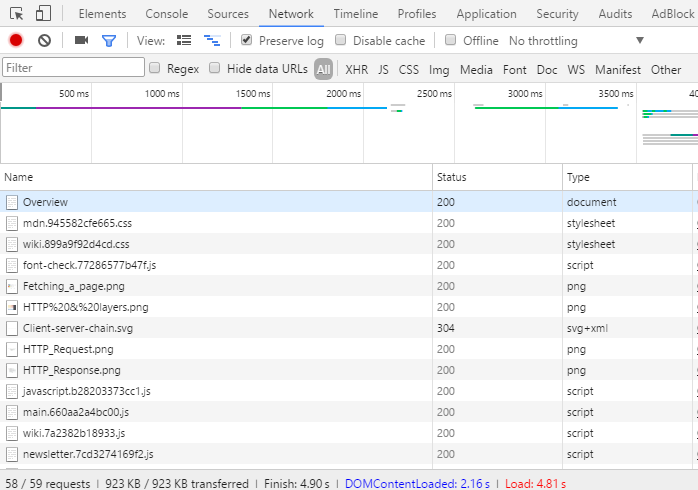

[Previous: Contents](README.md)

# Introduction to Web Development
Pranshu Gupta

## The Internet
The Internet is a network of networks of computers all over the world. It is an infrastructure that allows any two computers connected to the internet to communicate and share information with each other under some set of rules or protocols. HTTP, FTP, SMTP, IMAP etc are some of the protocols used on the internet.

[Wikipedia Article: Internet](https://en.wikipedia.org/wiki/Internet)

## The World Wide Web
The World Wide Web is an information sharing model built on top of the internet. It is an information space which houses a huge collection of interlinked documents that can be accessed via the internet under HTTP.
Each document on the internet has an address which is required to locate it on the network, this address is called URL (Uniform Resource Locator).
These documents can also have other associated resources such as videos, images etc. The language used to create these documents is called HTML.

The World Wide Web is not synonymous to the internet, it is a part of the internet - a big part. Internet also contains other things like Email, FTP (File Transfer Protocol), DNS (Domain Name Service), TLS (Transport Layer Security) and other services,

[Wikipedia Article: WWW](https://en.wikipedia.org/wiki/World_Wide_Web)

## Hyper Text Transfer Protocol
HTTP is a protocol which allows the fetching of resources such as HTML documents over the internet. In a typical scenario, the web browser acts as the user-agent and sends requests for a HTML document hosted by some server. The server is a computer connected to the internet which handles the request and sends a response to the user-agent. The browser then parses this response and generates the view for the user. This may involve further requests to fetch images and other multimedia files embedded in the document.

We can use the Developer Tools provided in browsers to see all the HTTP requests that were made by the browser when we visit some website. To open developer tools in Google Chrome press Ctrl+Shift+J. The following image shows the requests made when fetching the page at https://developer.mozilla.org/en-US/docs/Web/HTTP/Overview

HTTP is simple, HTTP messages can be read and understood by humans. This allows easier testing and development. We can use http-console package in node to run simple HTTP requests.

    $ sudo npm install http-console2 -g
    $ http-console http://pranshu258.github.io
    > http-console 0.7.0
    > Welcome, enter .help if you're lost.
    > Connecting to pranshu258.github.io on port 80.
    http://pranshu258.github.io:80/> GET /

Here we have made a HTTP GET request for a webpage located at pranshu258.github.io, the response that we get from the server is as follows:

    HTTP/1.1 200 OK
    Server: GitHub.com
    Content-Type: text/html; charset=utf-8
    Last-Modified: Thu, 11 May 2017 14:52:49 GMT
    Access-Control-Allow-Origin: *
    Expires: Thu, 11 May 2017 21:51:34 GMT
    Cache-Control: max-age=600
    X-Github-Request-Id: F5B0:6A1A:AB9C3:E169E:5914DA8C
    Content-Length: 17711
    Accept-Ranges: bytes
    Date: Thu, 11 May 2017 21:46:07 GMT
    Via: 1.1 varnish
    Age: 273
    Connection: close
    X-Served-By: cache-ams4122-AMS
    X-Cache: HIT
    X-Cache-Hits: 1
    X-Timer: S1494539167.138972,VS0,VE0
    Vary: Accept-Encoding
    X-Fastly-Request-Id: f350b745766fb29d77c71166a8f96782fe64648d
    <!DOCTYPE html>... (17711 bytes of HTML content)

We can also send headers in HTTP requests, for example the If-Match header. This header is used for cache validation with the help of ETag (Entity Tag). 

    If-Match: "bfc13a64729c4290ef5b2c2730249c88ca92d82d"

The server keeps a record of ETags for the documents it serves. Browsers often cache webpages to save bandwidth and show the cached data to user without actually fetching the page from the server. However, the document on the server might have been updated and the cache might no longer be valid. The browser can ensure the validity of the cached document by requesting the server for the document with the ETag of cached doc, if the server has the unmodified document then the ETag would match and it would respond with OK status which means the cache is valid. Otherwise, if the document has been modified, the ETag does not match and server responds as follows:

    HTTP/1.1 412 Precondition Failed
    Server: Varnish
    Retry-After: 0
    Content-Type: text/html; charset=utf-8
    Content-Length: 451
    Accept-Ranges: bytes
    Date: Thu, 11 May 2017 21:51:08 GMT
    Via: 1.1 varnish
    Connection: close
    X-Served-By: cache-ams4449-AMS
    X-Cache: MISS
    X-Cache-Hits: 0
    X-Timer: S1494539468.150815,VS0,VE1
    X-Fastly-Request-Id: 2969b1af4849f11287d91f26ca90a720419517ce
    <?xml version="1.0" encoding="utf-8"?>
    <!DOCTYPE html PUBLIC "-//W3C//DTD XHTML 1.0 Strict//EN" "http://www.w3.org/TR/xhtml1/DTD/xhtml1-strict.dtd">
    <html>
        <head>
            <title>412 Precondition Failed</title>
        </head>
        <body>
            <h1>Error 412 Precondition Failed</h1>
            
Precondition Failed

            <h3>Guru Mediation:</h3>
            
Details: cache-ams4151-AMS 1494539468 4042009446

            

            
Varnish cache server

        </body>
    </html>
    
Notice that the server that sent the response is not the actual github server but varnish server. Varnish server is used to cache the documents on the server side and most of the times this server may itself send the response to the client. This heavily speeds up the fetching of content.
In other cases, the main server may itself respond to the request instead of the varnish server if the varnish server is busy.

    HTTP/1.1 412 Precondition Failed
    Server: GitHub.com
    Content-Type: text/html; charset=utf-8
    Access-Control-Allow-Origin: *
    X-Github-Request-Id: 8CBE:6A18:1C90C4:25894B:5914E640
    Content-Length: 182
    Accept-Ranges: bytes
    Date: Thu, 11 May 2017 22:31:29 GMT
    Via: 1.1 varnish
    Connection: close
    X-Served-By: cache-ams4136-AMS
    X-Cache: MISS
    X-Cache-Hits: 0
    X-Timer: S1494541889.166829,VS0,VE97
    Vary: Accept-Encoding
    X-Fastly-Request-Id: 8434dc300a5a5ce479403e4a5c1b8d8f22242296
    <html>
        <head><title>412 Precondition Failed</title></head>
        <body bgcolor="white">
            
<h1>412 Precondition Failed</h1>

            

nginx

        </body>
    </html>

HTTP is extensible, new HTTP headers can be easily created to support additional features. HTTP headers allow the client and the server to pass additional information with the request or the response.

[MDN Article: HTTP Headers](https://developer.mozilla.org/en-US/docs/Web/HTTP/Headers)

HTTP is stateless, i.e. two successive requests on the same connection are completely independent of each other. But there are many applications that need state maintenance across requests, such as adding items to  shopping carts on e-commerce websites. Adding each item sends a new request, but because HTTP is stateless, we can not remember which items have already been added to the cart. Header extensions allow us to store HTTP cookies in the browser, these cookies contain context related data and can be read and modified by the browser to maintain state across requests.

## Hyper Text Markup Language

## Web Development

[Next: Github Pages](GitHub_Pages.md)